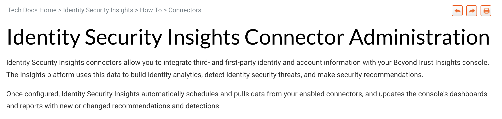

# User Guide: App Connectors [Download :fontawesome-solid-file-pdf:](../assets//pdfs/connectors-guide.pdf){ .md-button .md-button--primary }

## Summary
Following the General Audience launch of a new product, BeyondTrust Support stakeholders reported a need for additional descriptive how-to documentation around understanding, configuring, and using first- and third-part integrations. This guide was designed to reduce the barrier to entry for these product features, and to document the methods available for viewing connectivity status, details, and configuration options. 

---

## Resources
[Live Document](https://www.beyondtrust.com/docs/identity-security-insights/how-to/connectors/get-started.htm){ .md-button .md-button--primary } [Formatted PDF](../assets/pdfs/connectors-guide.pdf){ .md-button .md-button--primary }