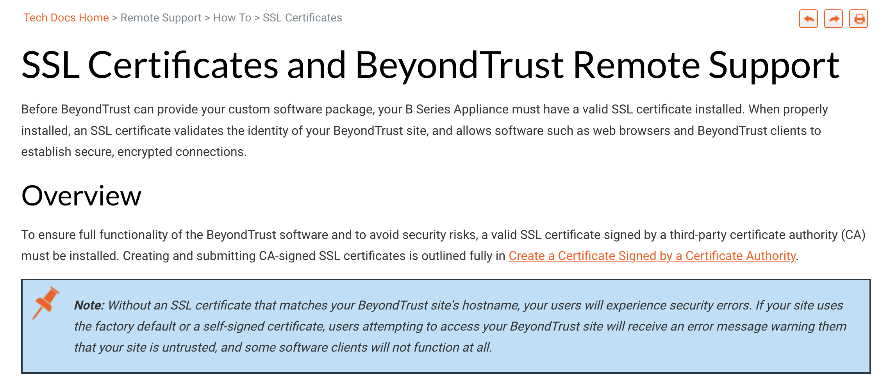

# User Guide: SSL Certificates [Download :fontawesome-solid-file-pdf:](../assets/pdfs/ssl-certificates.pdf){ .md-button .md-button--primary }

## Overview 
As part of ongoing content modernization efforts at [BeyondTrust](https://www.beyondtrust.com/docs/), an existing guide on SSL Certificate management registered as out-of-date in both instruction and style. Updating this guide required meeting with the Remote Support product SMEs, conducting independent research, and both rewriting and reformatting the existing content to match an internal documentation style guide. 

Per stakeholder request, sections of content were designed to appear on multiple pages. These sections were embedded on each page from a single source to reduce future maintenance efforts.

The resulting guide was more accessible and instructional for users of all skill levels, and accurate to the current state of the product.

---

## Resources
[Live Document](https://www.beyondtrust.com/docs/remote-support/how-to/sslcertificates/index.htm){ .md-button .md-button--primary } [Formatted PDF](../assets/pdfs/ssl-certificates.pdf){ .md-button .md-button--primary }