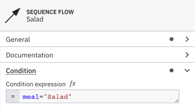
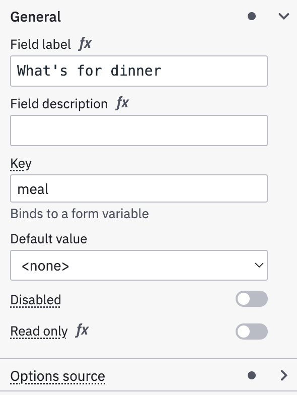
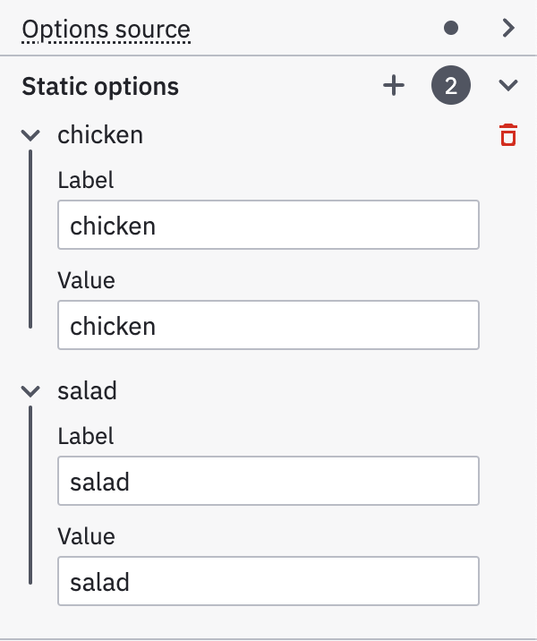
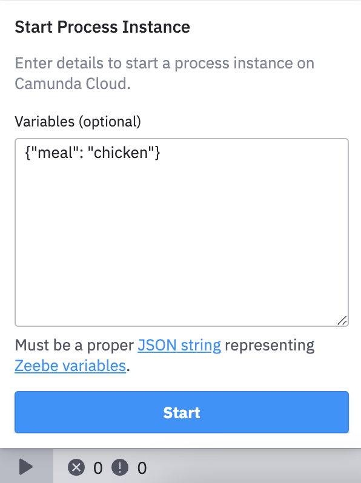
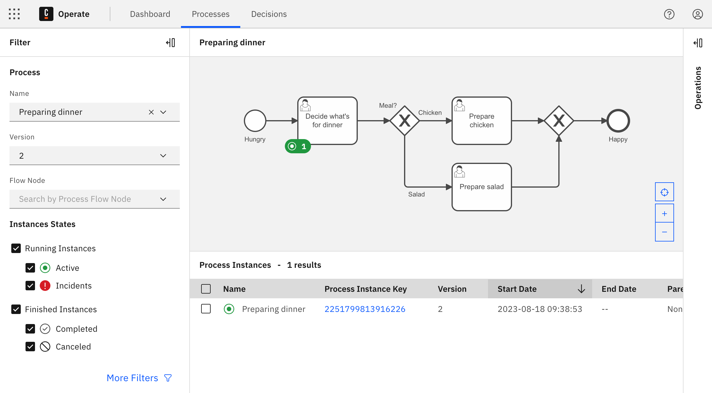
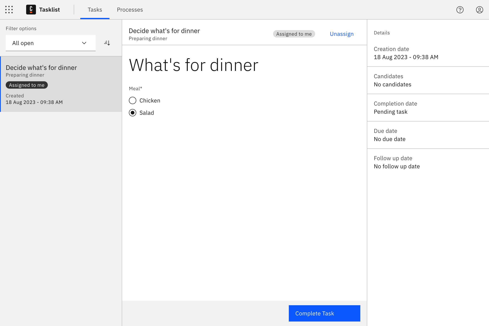

# Get started with human task orchestration

## Summary

This tutorial walks users through learning basic human task orchestration in [Camunda 8](https://docs.camunda.io/), demonstrating how to integrate human decision-making into automated workflows. The documentation process involved testing workflows in both deployment environments, updating examples to represent practical use cases, and explicitly documenting configuration differences to prevent confusion for users working across Camunda 8's deployment models.

---

## Overview

!!! abstract "Level and Duration"
    **Level**: Beginner  
    **Time**: 15 minutes

Learn the basics of human task orchestration by creating a simple dinner decision process. This low-code tutorial demonstrates how to create, assign, and complete user tasks in Camunda 8 using either Self-Managed or SaaS deployment.

## Prerequisites 

=== "Self-Managed"

      - OpenJDK 21+
      - Desktop Modeler

      

      
Java setup

      

      After installing OpenJDK, ensure `JAVA_HOME` is set by running `java -version` in a **new** terminal.

      If no version of Java is found, follow your chosen installation's instructions for setting `JAVA_HOME` before continuing.
      

      

      <h3> Install and Start Camunda 8 Run </h3>

      
      1. Download the latest release of [Camunda 8 Run](https://downloads.camunda.cloud/release/camunda/c8run/8.8/) for your operating system and architecture. Opening the `.tgz` file extracts the Camunda 8 Run script into a new directory.
      2. Navigate to the new `c8run` directory.
      3. Start Camunda 8 Run by running one of the following in your terminal:
         - **On Mac and Linux**:
               - Run the helper script: `./start.sh`
               - Or use the CLI command: `./c8run start`
         - **On Windows**:
               - Use the CLI command: `.\c8run.exe start`

      For more information and local configuration options, see the [Camunda 8 Run installation guide](c8run.md).

=== "SaaS"

      1. Visit [signup.camunda.com/accounts](http://signup.camunda.com/accounts) to sign up and create an account. Make sure your email address is verified before continuing.

      2. Navigate to [camunda.io](https://console.cloud.camunda.io/) and log in with the email address and password you used in the previous form.

      3. After login, click the navigation icon, and select Console to view the Console overview page. 

## Step 1: Create a new process

In this step, you will design a process that demonstrates how to route the process flow based on a user decision. In this example, you will create a process to decide what is for dinner.

### Create a new file

=== "Self-Managed"

      Within Desktop Modeler, select **BPMN diagram** under **Create a new file**.

=== "SaaS"

      1. Every file in Web Modeler requires a project. Within Modeler, click **New project**.
      2. Name your project and select **Create new > BPMN diagram**.
      3. Give your file a descriptive name. In this case, name it `Decide for Dinner`.
      4. Make sure to name the process itself as well. Click the empty canvas, and specify the process name and technical ID in the properties panel on the right side of the screen. This specifies how the process will appear in other tools of Camunda 8.

### Design the process

1. A **start event** is automatically added to the canvas. Click it to display configuration and append options.
2. Click the rectangular **Append Task** icon to append a task.
3. Enter a descriptive name for the task, such as `Decide what's for dinner`.
4. Change the task type by clicking on the element and selecting the **Change element** menu icon. Select **User Task**.
5. Select the user task and click on the diamond-shaped icon to append an exclusive gateway. The gateway allows to route the process flow differently, depending on conditions.
6. Select the gateway and append a task by clicking the task icon. Repeat it to create a second process flow. Name the tasks based on what the user decides to eat: in this case, we've named ours `Prepare chicken` and `Prepare salad`.
7. To route the user to the right task, add expressions to the **sequence flows**. Sequence flows are represented by arrows connecting the gateway to the tasks. To add an expression, click on a sequence flow to view the **properties panel**, and open the **Condition** section.
8. Verify the sequence flows have the following expressions: `meal = "Salad"` on one side, and `meal = "Chicken"` on the other. You will define the variable `meal` later when designing a form for the user task.
9. Connect the split process flows again. Append another exclusive gateway to one of the tasks. Select the other task and drag the arrow-shaped sequence flow tool to connect it to the gateway.
10. Select the gateway and add an **end event** to your process, denoted by the circle with the thick outline.

  

## Step 2: Design a form

You have now designed the process. To allow the user to make the decision, you will now design a form. Forms can be added to user tasks and start events to capture user input, and the user input can be used to route the process flow, to make calls to APIs, or to orchestrate your services.

=== "Self-Managed"

      1. Create a new Form in Desktop Modeler by navigating to **File -> New File -> Form (Camunda 8)**.
      2. Click and drag the **Text view** component (found under Presentation) to the empty form.
      4. Open the **General** section in the properties panel and enter a text, such as `What's for dinner?`.
      5. Click and drag the **Radio** component to the form to create a radio group. Give it a descriptive name within the properties panel.
      6. Additionally, set a **key** which maps to a process variable. The value of the component will be stored in this variable, and it can be read by the process that uses this form. As already defined by the conditions in the process earlier, use the variable `meal`.
      7. Scroll down to the **Static options** section of the properties panel to add radio options. Since there are two options for the dinner, add an extra value by clicking on the plus sign. Enter the value `Chicken` with the same label as `Chicken` and enter the value `Salad` with the label as `Salad` in the other value.
      8. In your form's properties panel, copy the Form ID for use in your process.

=== "SaaS"

      1. Select the user task you created in **[Step 1](#step-1-create-a-new-process)**.
      2. Click the blue **link icon** in the lower right corner. A menu expands that allows you to create a new form.
      3. Click **Create new form**. A form will be created and opened in the form editor. The form is automatically named.
      4. Click and drag the **Text view** component (found under Presentation) to the empty form. 
      5. Open the **General** section in the properties panel and enter a text, such as `What's for dinner?`.
      6. Click and drag the **Radio** component to the form to create a radio group. Give it a descriptive name within the properties panel.
      7. Additionally, set a **key** which maps to a process variable. The value of the component will be stored in this variable, and it can be read by the process that uses this form. As already defined by the conditions in the process earlier, use the variable `meal`.
      8. Scroll down to the **Static options** section of the properties panel to add radio options. Since there are two options for the dinner, add an extra value by clicking on the plus sign. Enter the value `Chicken` with the same label as `Chicken` and enter the value `Salad` with the label as `Salad` in the other value.

  

## Step 3: Link the form to your process

Once the form is designed, you must link it to your process.

=== "Self-Managed"

      1. Open the process you created in **[Step 1](#step-1-create-a-new-process)** by clicking on the process file's name in the top bar.
      2. Select the user task, and open the **Form** menu in the properties panel.
      3. In the Form menu, enter the **Form ID** for the form you created in **[Step 2](#step-2-design-a-form)**.

=== "SaaS"

      1. Click on the project name in the navigation history in the top bar to navigate back, and open the process you created in **[Step 1](#step-1-create-a-new-process)**.
      2. Select the user task. Click the blue **form link icon** to open the form menu.
      3. Select the form you just created, and click **link** to confirm.
      4. You can check if you linked the right form by clicking the form linking icon again. A preview of the form will appear.

## Step 4: Run your process

Your process is now ready to run. Given its human-centric nature, it is well suited to be run in Tasklist. In order to make it accessible from Tasklist, the process must be deployed first.

### Deploy and test run

=== "Self-Managed" 

      1. Click the rocket-shaped **Deploy** icon to begin deploying your process, and provide the following configuration:
         - **Target:** Self-Managed
         - **Cluster endpoint:** `http://localhost:26500`, the location of your Zeebe Gateway
         - **Authentication:** None
      2. Click **Deploy** to deploy your process.
      3. To run your new process, click the arrow-shaped **Run** icon, and provide your form input as JSON (for example, `{"meal": "chicken"}`).

         
{ width="300" }

      4. Click **Run** to run your process with the provided variables.

=== "SaaS"

      1. Click **Deploy** to deploy the process to your cluster. If you have not yet created a cluster, clicking **Deploy** will take you to Console to create a cluster first.
      2. After you deploy your process, it can be executed on the cluster. There are multiple ways to run a process. This time, click **Run** in Modeler for a test run.

### Check successful start in Operate

=== "Self-Managed"

      1. Open Operate at `http://localhost:8080/operate`, and select **Processes** from the top bar.
      2. In the **Process** panel, use the **Name** drop-down to select your process.
      3. A visualization of your running process instance now displays in Operate, and your user task is marked with a green **token** icon. This means that a task is waiting to be worked on in Tasklist.

=== "SaaS"

      1. The process start will be confirmed via a notification message on the screen. Click the **chevron icon** next to **Run** to open more options. Click **View process instances** to see the running process in Operate.
      2. In Operate, you will see a visualization of the running process instance. Notice that a green **token** is waiting at the user task. This means that a task is waiting to be worked on in Tasklist.

## Step 5: Complete a user task

When the process instance arrives at the user task, a new user task instance is created in Zeebe. The process instance then pauses and waits until the user task is completed. 

Applications like Tasklist can be used by humans to complete these tasks. In this last step, you will open Tasklist to run the user task you created.

=== "Self-Managed"

      1. Open Tasklist at `http://localhost:8080/tasklist`.

=== "SaaS"

      1. Click the **navigation menu icon** next to the Camunda logo in the top bar to open the global navigation, and click **Tasklist** to open the Tasklist application.

Once you have access to Tasklist:

1. On the left, you will notice a list of **tasks**. There should be one open task `Decide what's for dinner`. Click this task to open it in the detail view.
2. In the detail view, the form you created in **[Step 2](#step-2-design-a-form)** appears. It is read only since this task is currently unassigned. You have to claim the task to work on it. Next to **Assignee**, click **Assign to me** to claim the task.
3. Select one of the radio options.
4. Click **Complete Task** to submit the form.
      

5. To verify your task completion, you can filter by **Completed** tasks in the left task list panel.

You can now navigate back to **Operate**, where the process instance has continued.

The token moves through the exclusive gateway (also called the XOR gateway), and is used to model the decision in the process. When the execution arrives at this gateway, all outgoing sequence flows are evaluated in the order in which they have been defined. The sequence flow which condition evaluates to `true` is selected for continuing the process.

In this case, the token will move through the gateway and, according to the conditional expressions we outlined earlier, to the selected dinner based on the **Decide what's for dinner** user task we completed. If we select **Chicken**, the token moves forward to **Prepare chicken**. If we select **Salad**, the token moves forward to **Prepare salad**.