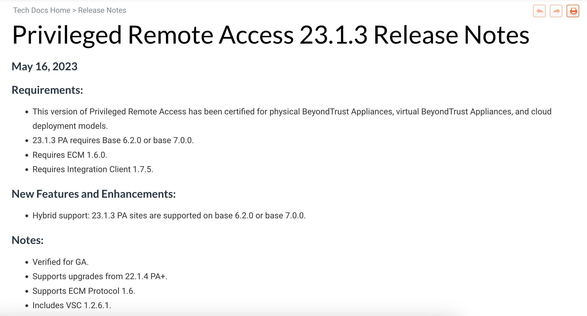

# Release Notes

## Summary
These release notes are from a series of products across the [BeyondTrust](https://www.beyondtrust.com/docs/) platform. Release notes were designed with both external and internal versions, separating information required by the public from communications needed for internal stakeholders and support teams. 

=== "Identity Security Insights"
    

    [Live Document](https://www.beyondtrust.com/docs/release-notes/identity-security-insights/identity-security-insights-23-09.htm){ .md-button .md-button--primary } [Formatted PDF](../assets/pdfs/insights-release-notes.pdf){ .md-button .md-button--primary }

=== "Remote Support"
    

    [Live Document](https://www.beyondtrust.com/docs/release-notes/remote-support/base/base-7-0-0.htm){ .md-button .md-button--primary } [Formatted PDF](../assets/pdfs/rs-release-notes.pdf){ .md-button .md-button--primary }

=== "Privileged Remote Access"
    

    [Live Document](https://www.beyondtrust.com/docs/release-notes/privileged-remote-access/privileged-remote-access-23-1-3.htm){ .md-button .md-button--primary } [Formatted PDF](../assets/pdfs/pra-release-notes.pdf){ .md-button .md-button--primary }
